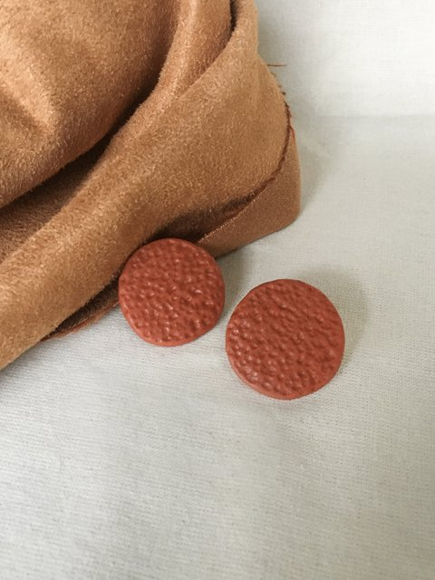
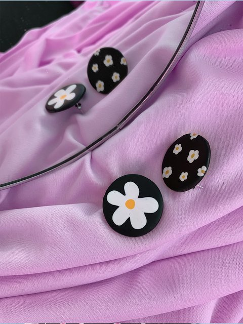
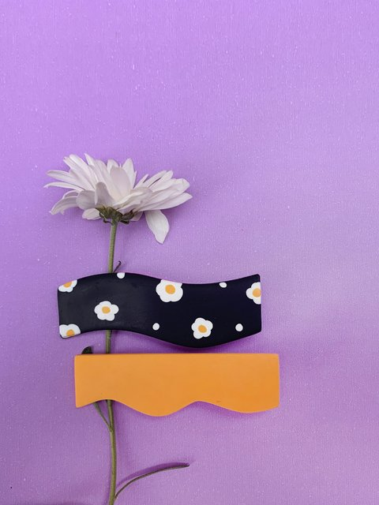

# LandingPage-PedrinaDesign

<!DOCTYPE html>

<html lang="pt-br">
    <head>
        <meta charset="utf-8">
        <title>pedrinadesign</title>
        <link rel="stylesheet" href="./style.css">
        <meta name="viewport" content="width=device-width, inicial-scale=1.0, maximum-scale=1.0">
        <link rel="shortcut icon" href="./WhatsApp Image 2021-10-21 at 15.08.31.jpeg" type="image/x-icon">
        <link rel="stylesheet" href="./bootstrap/bootstrap-5.1.0-dist/css/bootstrap.min.css">

    </head>

    <body>
        

           
            <header class="cabeca">
                
                

                    <a href="https://pedrinadesign.com/">Início</a>
                    <a href="https://pedrinadesign.com/produtos/">Produtos</a>
                    <a href="https://pedrinadesign.com/contato/">Contato</a>
                    <a href="https://pedrinadesign.com/quemsomos/">Quem somos</a>
                    <a href="https://pedrinadesign.com/crieseuacessorio/">Personalize</a>
                

            </header>

            

                

                    <h1>Você pode ter um acessório do seu jeitinho e nós vamos te contar como:</h1>
                    <h3>seja pra alterar o tamanho, a cor, ou ainda tirar do papel um modelo mega exclusivo, estamos aqui pra fazer tudo isso ser real pra você!</h3>
                    <button>Conheça</button>
                

               
                

                    

                        

                            
                        

                        

                            
                        

                        

                            
                        

                    

                    <button class="carousel-control-prev" type="button" data-bs-target="#carouselExampleInterval" data-bs-slide="prev">
                        
                        Previous
                    </button>
                    <button class="carousel-control-next" type="button" data-bs-target="#carouselExampleInterval" data-bs-slide="next">
                        
                        Next
                    </button>
                

                

                    
                    <!--
                     <a href="https://icons8.com/icon/85154/instagram">Instagram icon by Icons8</a> ->
                    --> 
                

            

        
        

        
        
    </body>

</html>
